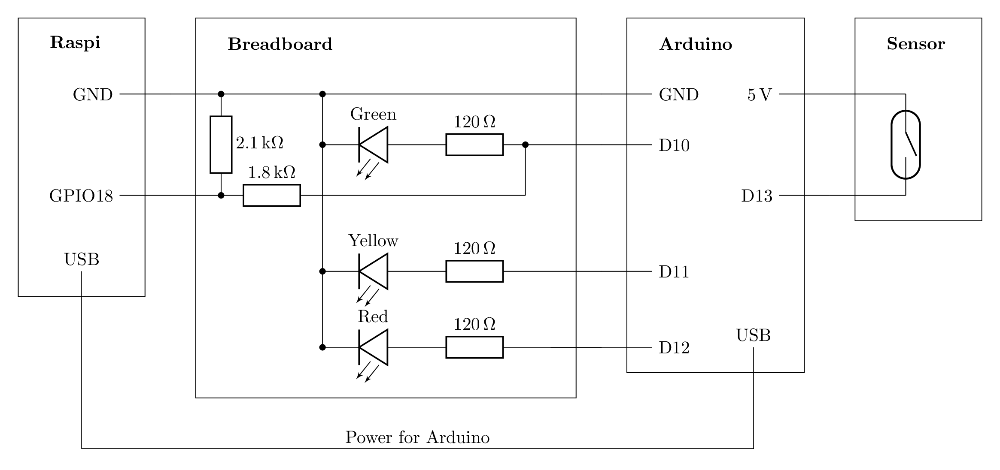

# Space Status Circuit

The status of Krautspace's door is captured, displayed and broadcast into the
internet by an Arduino, a Raspberry Pi, and some circuitry. The following
diagram shows a detailed representation of the circuit.

The Arduino is (and should be only) responsible for the sensor read out and the
local status display (traffic light).

The Raspberry Pi is (and should be only) responsible for grabbing the status
from the Arduino and broadcasting it to the internet.

## Sensor

The locked-unlocked-state of the door is determined by a reed switch
embedded in the strikeplate hole, that is triggered by a magnet glued to the
lock's deadbolt.

The switch is connected to the Arduino via two wires.

## Arduino

The system uses an Arduino Duemilanove. It monitors the state of the reed switch
and controls three LEDs on the breadboard.

The reed switch is connect to a 5V pin and pin D13. Note, that pin D13 also
controls the on-board LED, so whenever the switch is in the closed state (DOES
THIS CORRESPOND TO THE DOOR BEING IN THE CLOSED STATE?), the on-board LED is on.

Three LEDs, green, yellow, and red, on a breadboard have their anodes connected
to pins D10, D11, and D12 and their cathodes to GND.

The Arduino gets its power via a USB cable from the Raspberry Pi. This gives
them with a common ground. If this were not the case, the connection between
their grounds via the breadboard, as it exists right now and is shown in the
diagram, would be required.

The logic of how the state of the reed switch is converted into the state of the
LEDs is discussed in the documentation of the Arduino software.

## Circuit

The circuit uses 120Ω series resistors for the LEDs.

The circuit also includes a voltage divider for the Raspberry Pi's connection
to the anode of the green LED. The voltage is reduced from 5V to
1.8kΩ/(1.8kΩ + 2.1kΩ) * 5V ~= 0.5 * 5V ~= 2.5V.

## Raspberry Pi

The system uses a Raspberry Pi Model 3.

The Raspberry Pi grabs the state of the green LED from its anode on the
breadboard. This is done via pin GPIO18.

The logic of how this state is communicated to the internet is discussed in the
documentation for the Raspberry Pi software.
